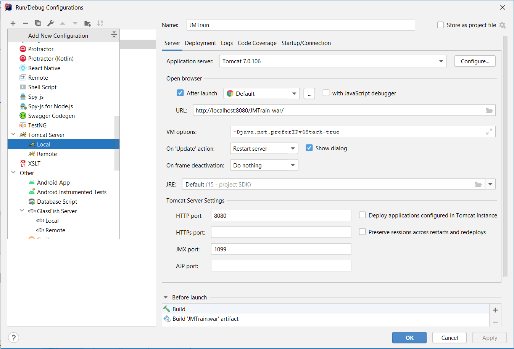
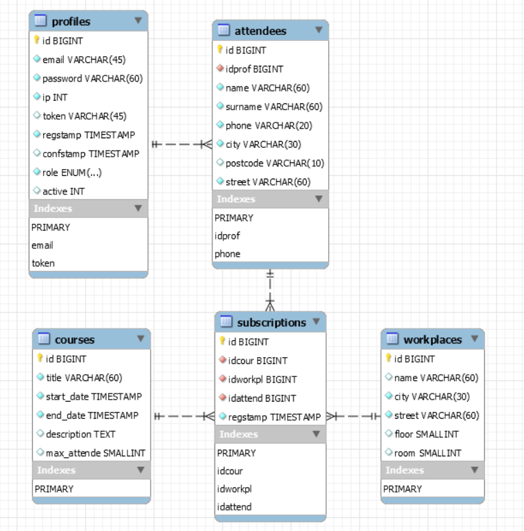

# JMTrain - Java course manager

## Description

Application allow to management courses. Program allow edit personal users data and add enrollments for courses. 
The application is secure - sends confirmation via email after registration and encrypts passwords. Database writes 
data use algorithm MD5.

## Changelog
* 0.0.4 - add better README.MD, fix bugs with names. Clear start page.
## Requirements

### Software

* Java
    * [Oracle JDK](https://www.oracle.com/java/technologies/javase-jdk15-downloads.html) (better option on **Windows**)
    * [OpenJDK](https://openjdk.java.net/install/) (better option on **Linux**)
* Database engine:
    * [MySQL Server](https://dev.mysql.com/downloads/windows/installer/8.0.html).
    * MariaDB part of [XAMPP](https://www.apachefriends.org/pl/download.html).
* [Tomcat 7](https://tomcat.apache.org/download-70.cgi) - HTTP server for Java
* [Maven](http://maven.apache.org/download.cgi) integrated with your IDE.

### Maven dependencies

* junit-jupiter-api 5.4.2
* mysql-connector-java 8.0.16
* javax.servlet-api 4.0.1
* commons-logging 1.2
* spring-beans 4.1.4.RELEASE
* spring-core 4.3.21.RELEASE
* spring-jdbc 4.1.4.RELEASE
* spring-tx 4.1.4.RELEASE
* taglibs-standard-impl 1.2.1
* taglibs-standard-spec 1.2.1
* junit 4.13.1
* javax.mail-api 1.6.0

## Deployment guide
#### General information
1) Download and unpack **JDK** from 
[Oracle](https://www.oracle.com/java/technologies/javase-jdk15-downloads.html)
(Windows x64 Compressed Archive)
2) Add Java to the PATH on **Windows 10** - [HELP](https://www.architectryan.com/2018/03/17/add-to-the-path-on-windows-10)
3) Clone repository using **GIT** or download zip archive.
4) Open project in your favourite IDE or compile class from command line.

#### Open project using IntelliJ IDEA
1) Download [IntelliJ IDEA Community](https://www.jetbrains.com/idea/)
2) Clone project from Github - [HELP](https://www.jetbrains.com/help/idea/manage-projects-hosted-on-github.html)

#### Configuration application server using IntelliJ IDEA
1) Download and unpack **Tomcat** from 
[Apache Foundation](https://tomcat.apache.org/download-70.cgi).
2) Setting up Tomcat 7 - [Details](https://federicoponte.wordpress.com/2013/08/02/setting-up-tomcat-7-with-intellij-idea/)
    * Uncompress the folder anywhere you want
    * **Click on Run -> Edit Configurations…**
    -> Search on the left for Tomcat Server and select Local
    * **Click on Run -> Edit Configurations…** Click on the + sign
    * On server card in input **VM Options** and write: *-Djava.net.preferIPv4Stack=true*
    * Select Tomcat Server Local -> Go to Deployment tab
    * Click on the + sign, select artifact you want to add to the server.
      
3) Try running application, you should see web page. In next step you must config database.

#### Add database and config connection
1) Create specific user for via MySQL console.

    ```SQL
    CREATE USER 'jmtrain_user'@'localhost' IDENTIFIED BY 'jmtrain_pass';
    ```
2) Configure credentials for created user.

    ```SQL
   GRANT ALL PRIVILEGES ON * . * TO 'jmtrain_user'@'localhost';
    ```
3) Quit with console and log in again (password: jmtrain_pass):
    ```cmd
   mysql -u jmtrain_user -p
    ```
3) Create database and use it.

    ```SQL
   CREATE DATABASE JMTrainDB CHARACTER SET utf8mb4 COLLATE utf8mb4_polish_ci;
   USE JMTrainDB;
    ```    
3) Create tables use SQL file [CREATE.SQL](sql/scripts/CREATE.sql).
4) Insert sample use SQL file [INSERT.SQL](sql/scripts/INSERT.sql).
    *  passwords are encrypted [MD5 Hash Generator](https://www.md5hashgenerator.com/)
    <br /> **When you are want log in check user id and password** in [users_passwords](sql/conf/users_passwords) file.
    * all profiles are default active 
6) Add profile and active it used gmail account:
    * mail: **mailbox.jmtrain@gmail.com**
    * password: **Pangeon66#**

See more by reviewing the class code: 
* [EmailSender](src/main/java/san/jee/cecherz/util/EmailSender.java) 
* [TokenProvider](src/main/java/san/jee/cecherz/util/TokenProvider.java)

## Database structure


## Author

* Kamil Cecherz as [pangeon](https://cecherz.pl)

## License


